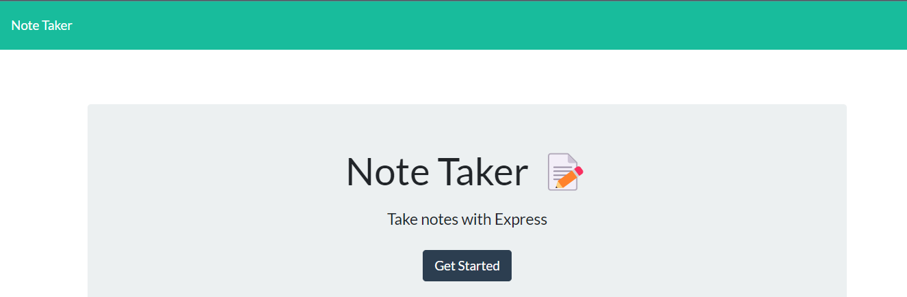

# Take Note!
 
  ## Description
  Take Notes is an exercise in Express.js, creating server routes that can store and receive information in the form of written notes. The javascript functionality was pre-written, but everything server-side was made by me.
  
  ## Table of Contents
  
  * [Installation and Usage](#installationandusage)
  * [Contributions](#contributions)
  * [Links](#links)
  
  # Installation and Usage
  1. Run 'NPM install' 2. Run 'NPM start' to boot up the server. 3. 'http://localhost:3001/' will access the landing page, then you can get started and create notes, saving them with the little icon in the corner.
  
  ## Contributions
  There are functionality improvements that definitely need to be adjusted. The JavaScript doesn't seem to want to display the note array on the sidebar as it should, despite being set up to do so. Also, the JavaScript is set up for a delete button functionality, but that's not wired to the server yet.
  
  ## Links
  * Repository: https://github.com/xiov91/take-notes
  * Deployed: https://xiov91.github.io/take-notes/
  * GitHub: xiov91
  * E-Mail: xiovacc@gmail.com
  
    